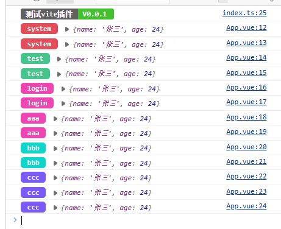
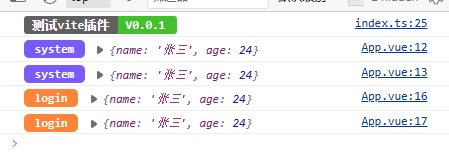

## 初衷
    为了方便管理项目日志，能快速控制日志模块的输出，部署时也能快速清空所有日志

## 使用说明
### 安装
```
npm install vite-plugin-kjxing-log -D
```
### 基本使用
```typescript
import VitePluginKjxingLog from "vite-plugin-kjxing-log";

export default defineConfig({
  plugins: [
      vue(),
      VitePluginKjxingLog()
  ],
})
```
App.vue
```typescript
import {KLog} from "vite-plugin-kjxing-log";

KLog.version("测试vite插件", "0.0.1");

const data = {
    "name": "张三",
    "age": 24
}

KLog.log("system", data);
KLog.log("system", data);
KLog.log("test", data);
KLog.log("test", data);
KLog.log("login", data);
KLog.log("login", data);
KLog.log("aaa", data);
KLog.log("aaa", data);
KLog.log("bbb", data);
KLog.log("bbb", data);
KLog.log("ccc", data);
KLog.log("ccc", data);
KLog.log("ccc", data);
```
效果图



### 自定义输出模块
```typescript
export default defineConfig({
  plugins: [
      vue(),
      VitePluginKjxingLog({
          all: false,
          modular: ["login", "system"]
      })
  ],
})
```
效果图



### 清空日志
```typescript
export default defineConfig({
  plugins: [
      vue(),
      VitePluginKjxingLog({
          all: false,
          modular: []
      })
  ],
})
```